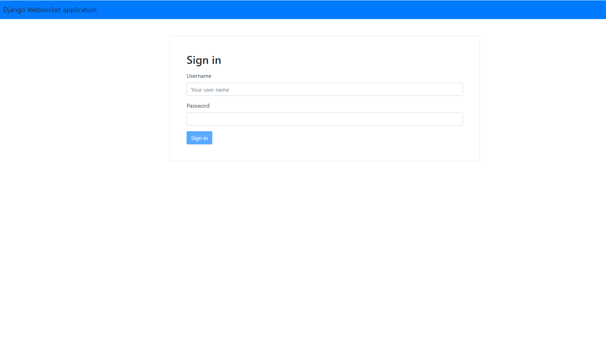
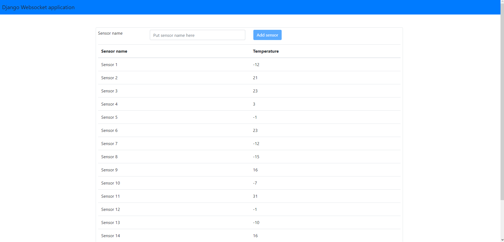

# Question 3

## Disclaimer

Well, this works only in debug mode for now.

## Installation

This project requires the following software to be installed:

* Python 3.7.1
* NodeJs 11.0.0

The solution was tested only for the described configurations. Currect work with other configurations is not guaranteed.

Installation includes the fllowing steps:
1. In git repository folder run the following command to initiate virtual environment:

```bash
python3 -m venv venv
```

2. Activate virtual environment by running:

```bash
venv\Scripts\activate
```

3. If everything is done correctly you should see *(venv)* in the beginning of the console line.

4. Install all required Python packages. This requires switching to folder Question3 (it is subfolder of repository folder) and running:

```bash
pip install -r packages.txt
```

5. When the command is finished switch to folder *frontend*. It is in Question3 folder and run:

```bash
npm install -g create-react-app
npm install
```

6. Then you need to return to Question3 folder and configure Django. I.e., run migrations and create superuser:

```bash
python3 manage.py migrate
python3 manage.py createsuperuser
```

7. That's it.

## Running the application

1. First, you should launch websocket "broker". Switch to folder Question3 in repository folder and run:

```bash
python3 ws_server.py
```

2. Then you should start Django app by running:

```bash
python3 manage.py runserver
```

3. Then switch to frontend folder and run:

```bash
npm run start
```

4. Open frontend at address localhost:3000. You will see authorization window:



5. Provide your superuser credentials and you will be able to start working with the application.

## Working with the application

The application's window looks in the following way:



The idea is the following. All temperature values are generated by a sensor. So first, there should be a sensor from which we could fetch data.
To create a sensor type its name to *Sensor name* field and press *Add sensor* button. Values will start to appear automatically.

## Details, future work.

As web socket engine WebSockets are used. The reason is that they are quite easy to use and do not require additional software, e.g., message broker.
Currently, it is a separate python script acting as a broker. But, perhaps, it should be integrated into Django application.
Frontend is done with ReactJs. Therefore, Django templates are not used. Instead, Djanfo REST framework is employed. Authorization (which obviously should be
significantly improved) is toke-based. I assume this application will not be used in production. It is based on debug servers provided by
Django/Node. Cross-origin requests are allowed (as frontend and backed do not reside at the same "host"). However, it is a nice debugging setup.
There should be also Unit tests for both frontend and backend.


